# Evidence Pack — W7: Capstone Hackathon — Ship Production-Ready AI in 48 Hours

## Group 6 — HexaCode

---

## Section 1 — Cover

| Field                | Details                                                                                             |
| -------------------- | --------------------------------------------------------------------------------------------------- |
| **Group Number**     | Group 6                                                                                             |
| **Member Names**     | Minh Tuấn · Thành Vinh · Anh Hoàng · Hoàng Nhân · Mạnh Khang · Ngọc Thắng · Đình Thông · Thành Tâm  |
| **Link Repo**        | [GitHub repo URL](https://github.com/H1eu232/w7-evidence-pack-group-6.git)                          |
| **Live Demo URL**    | [CloudFront HTTPS URL](https://hexacode.codes)                                                      |
| **W6 Evidence Pack** | [W6_evidence](https://github.com/H1eu232/w7-evidence-pack-group-6/blob/main/docs/w7_evidence_G6.md) |

---

## Section 2 — Domain & Product Vision

### 2.1 Use Case & Target Users
StudyBot là một nền tảng SaaS EduTech sử dụng công nghệ RAG, được thiết kế cho sinh viên đại học, người tự học và các ứng viên chuẩn bị cho các kỳ thi chứng chỉ. Người dùng tải tài liệu (PDF, TXT, MD), hệ thống sẽ trích xuất, phân mảnh (chunk) và lưu trữ vector. Người dùng có thể chat hỏi đáp, tạo các bài quiz trắc nghiệm tương tác và học qua thẻ Flashcard 3D xoay.

### 2.2 Target Market & Parallels
- **Đối tượng:** Sinh viên đại học quản lý khối lượng lớn bài giảng, người học chứng chỉ chuyên môn cần phản hồi ôn tập nhanh.
- **Sản phẩm tương tự:** Google NotebookLM (hỏi đáp tài liệu), Quizlet AI (flashcard và quiz), Khanmigo (gia sư AI tương tác).

### 2.3 User Stories

| Vai trò | Câu chuyện người dùng (Hành động & Mục tiêu) | Chi tiết triển khai |
| :--- | :--- | :--- |
| **Học viên** | **Tải tài liệu:** Tải lên bài giảng (PDF/TXT) để hệ thống tự động chỉ mục. | S3 lưu trữ file, Lambda xử lý trích xuất văn bản và nạp vào Vector Store. |
| **Học viên** | **Dashboard:** Xem số liệu thống kê (tài liệu, câu hỏi, quiz) để theo dõi tiến độ. | Frontend lưu cache và hiển thị số liệu qua `localStorage`. |
| **Học viên** | **Chat Q&A:** Đặt câu hỏi và nhận câu trả lời có dẫn nguồn cụ thể. | Lambda gọi Bedrock Converse API, truy xuất chunk tương ứng và trả về Frontend. |
| **Học viên** | **Quiz trắc nghiệm:** Làm bài trắc nghiệm trích xuất từ tài liệu để kiểm tra kiến thức. | Frontend gửi yêu cầu cấu hình, nhận dữ liệu JSON của quiz từ Bedrock để hiển thị. |
| **Học viên** | **Flashcards:** Học từ vựng thông qua thẻ xoay 3D và tự đánh giá độ nhớ. | Frontend tạo thẻ học khái niệm bằng AI hoặc dữ liệu mock ngoại tuyến. |

---

## Section 3 — System Architecture & VPC Isolation

### 3.1 Sơ đồ kiến trúc hạ tầng (Mermaid)

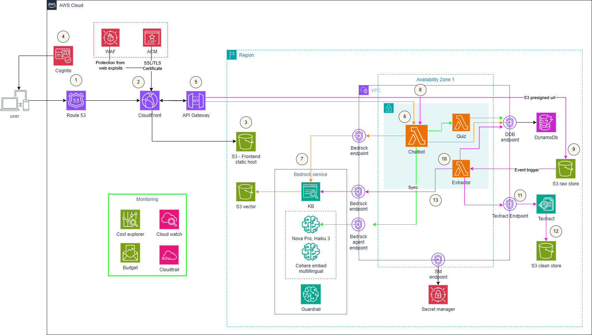

---

### 3.2 Network Isolation — Cấu hình Security Group (Mandatory #6)

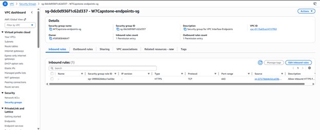

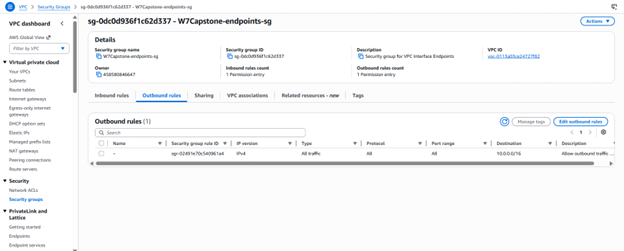

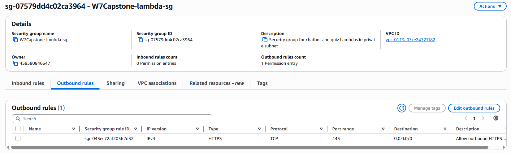

<sub>Note: Ảnh chụp cấu hình Inbound Rules của Security Group bảo vệ Database hoặc Private resources. Quy tắc chỉ cho phép truy cập từ Security Group của Compute Layer (Lambda/EC2 SG), không mở cổng ra internet (0.0.0.0/0).</sub>

---

### 3.3 VPC Endpoints — Kết nối nội bộ không qua NAT Gateway

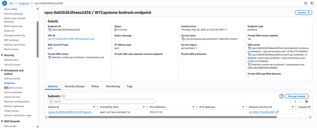

<sub>Note: Ảnh chụp danh sách VPC Endpoints trong tài khoản (Gateway Endpoint cho S3/DynamoDB và Interface Endpoint cho Bedrock), giúp hệ thống hoạt động hoàn toàn trong mạng nội bộ VPC an toàn và tránh chi phí duy trì NAT Gateway (~1.5 USD/ngày).</sub>

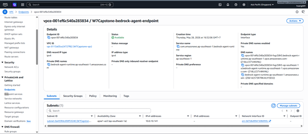

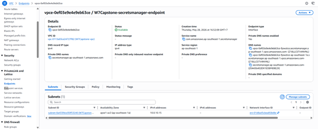

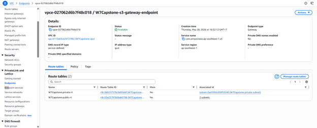
---

### 3.4 IAM Least-Privilege Execution Role (Mandatory #7)

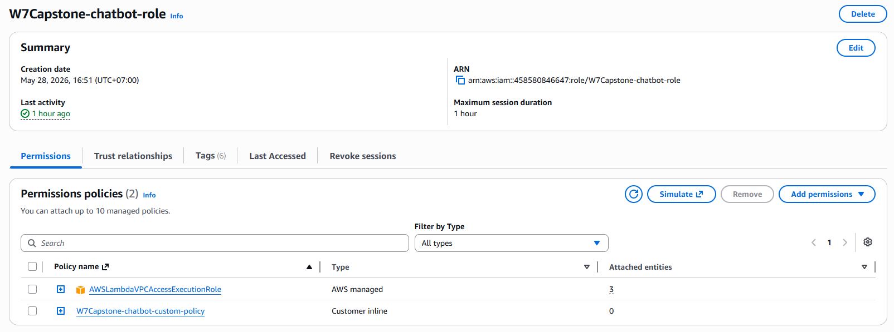

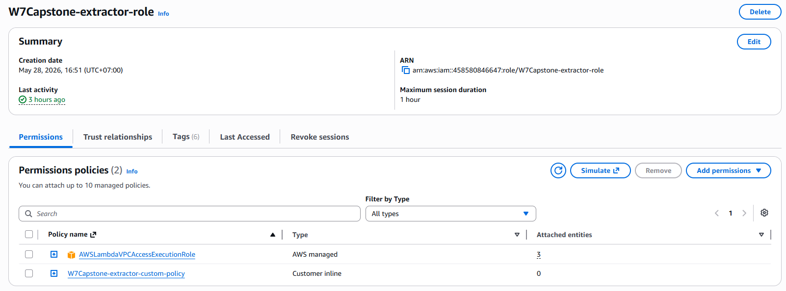

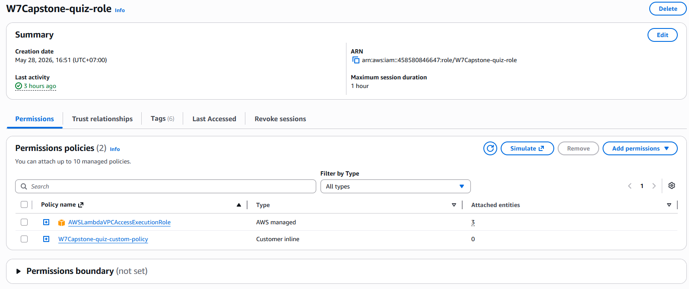

<sub>Note: Cấu hình chính sách IAM (Policy) đính kèm vào Execution Role của Lambda compute. Chỉ cấp quyền đọc/ghi tối thiểu trên đúng ARN của S3 bucket, DynamoDB Table và Bedrock Model cụ thể, không sử dụng quyền Administrator hoặc tài nguyên đại diện `*`.</sub>

---

## Section 4 — MH-COST-V — Cost Visibility & Attribution

### 4.1 Tagging Schema áp dụng cho Capstone

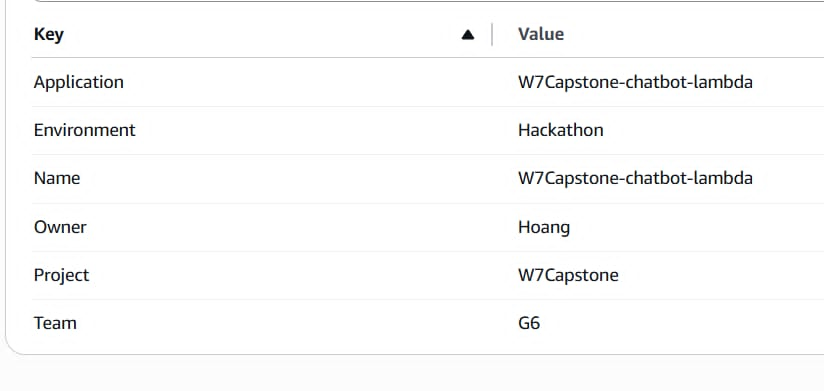

<sub>Note: Ảnh chụp tab Properties/Tags của S3 Bucket chứa tài liệu bài học, hiển thị đầy đủ bộ 4 Tag key bắt buộc: Project, Team, Owner, và Environment.</sub>

---

### 4.2 Gắn nhãn tài nguyên thực tế (Tagging Verification)

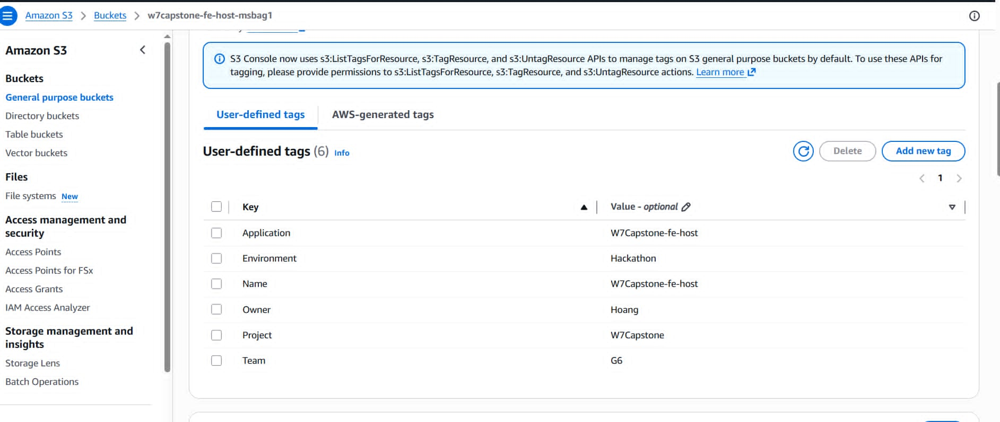

<sub>Note: Ảnh chụp tab Properties/Tags của S3 Bucket chứa tài liệu bài học, hiển thị đầy đủ bộ 4 Tag key bắt buộc: Project, Team, Owner, và Environment.</sub>

---

### 4.3 AWS Budget Alerts & Cost Anomaly Detection Setup

**Cấu hình ngân sách AWS Budgets:**

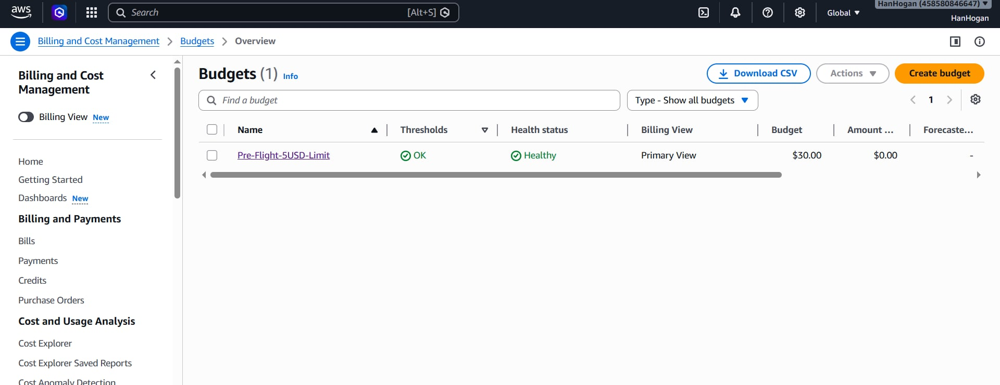

<sub>Note: Ngân sách Budget được thiết lập ở hạn mức $100 USD (cảnh báo ở mức 80% tức $80 USD) gửi cảnh báo về email nhóm thông qua cổng SNS. Trạng thái email đăng ký đã được xác nhận (Confirmed).</sub>

**Cấu hình Cost Anomaly Detection:**


<sub>Note: Monitor cảnh báo chi tiêu bất thường dựa trên thuật toán học máy (ML-based) đã được khởi tạo thành công để phát hiện sớm các sự cố chi phí.</sub>

---

### 4.4 Baseline Cost Breakdown (Theo dõi chi phí Cost Explorer)

**Cost Explorer Ngày 1 EOD:**

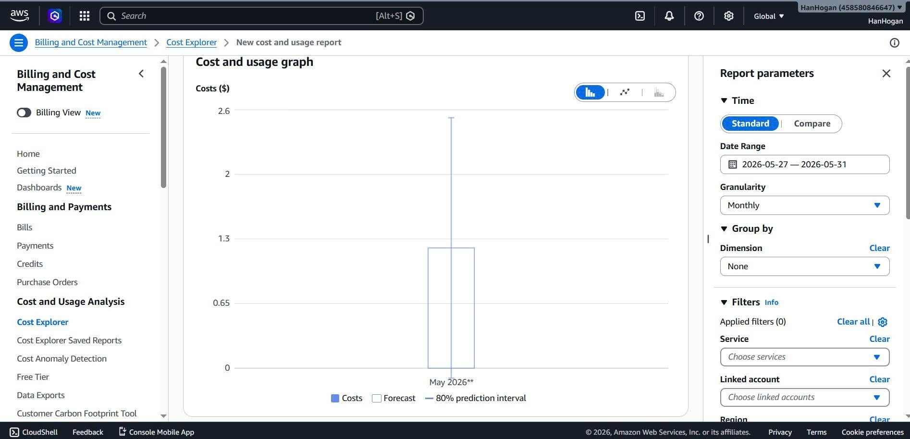

<sub>Note: Ảnh chụp Cost Explorer lọc theo nhãn `Team=G6` vào cuối ngày thứ nhất sau khi khởi tạo toàn bộ tài nguyên nền tảng.</sub>

**Cost Explorer Ngày 2 EOD:**

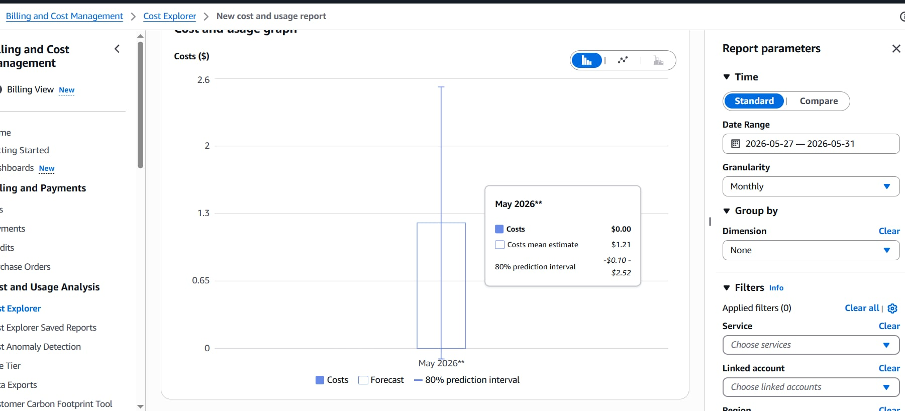

<sub>Note: Ảnh chụp Cost Explorer vào cuối ngày thứ hai sau khi tích hợp toàn bộ các tính năng AI Bedrock và thiết lập giám sát.</sub>

**Cost Explorer Sáng Thứ Sáu (Pre-Demo):**


<sub>Note: Chi phí cập nhật mới nhất vào sáng Thứ Sáu trước giờ thuyết trình dự án Capstone, cam kết nằm dưới hạn mức $100 USD.</sub>

---

### 4.5 Quan sát Top 3 Cost Driver:
1. **Amazon Bedrock (Claude 3.5 Haiku + Titan Embeddings)**: Chi phí xử lý token và sync dữ liệu RAG.
2. **VPC Endpoints (Interface Endpoints)**: Chi phí duy trì kết nối private bảo mật sang dịch vụ Bedrock theo giờ.
3. **Amazon CloudFront**: Chi phí phân phối tài nguyên tĩnh và truyền dữ liệu mạng (Data Transfer Out).

---

## Section 5 — Security & Encryption Details

### 5.1 Root Account Multi-Factor Authentication (MFA)

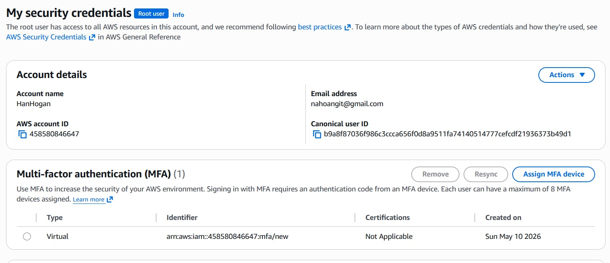

<sub>Note: Ảnh chụp IAM Dashboard của tài khoản AWS cá nhân, xác nhận tài khoản Root đã được cấu hình xác thực đa yếu tố (MFA) thành công bằng ứng dụng bảo mật.</sub>

---

### 5.2 Amazon Bedrock Model Access

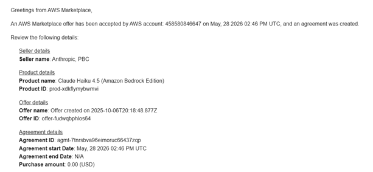

<sub>Note: Ảnh chụp trang quản lý quyền truy cập mô hình trên Amazon Bedrock, chứng minh quyền sử dụng các dòng mô hình Claude 3.5 Haiku và Titan Embeddings v2 ở trạng thái "Access granted".</sub>

---

### 5.3 S3 Block Public Access & Default Encryption

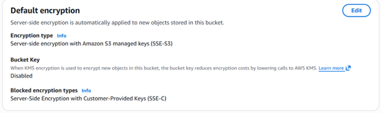

<sub>Note: Ảnh chụp phần cấu hình bảo mật của S3 Bucket, hiển thị chế độ "Block all public access" đang được kích hoạt (ON) và mã hóa mặc định Server-side Encryption (SSE-S3 hoặc KMS CMK) được áp dụng.</sub>

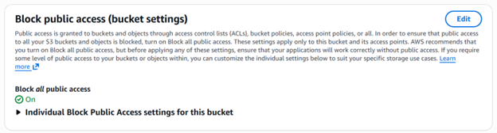

<sub>Note: Ảnh chụp phần cấu hình bảo mật của S3 Bucket, hiển thị chế độ "Block all public access" đang được kích hoạt (ON) và mã hóa mặc định Server-side Encryption (SSE-S3 hoặc KMS CMK) được áp dụng.</sub>

---

## Section 6 — Optional Capabilities (Nhóm chọn Option A)

### OPTION A — Full Observability (#8)

**CloudWatch Dashboard giám sát hệ thống:**


<sub>Note: Giao diện CloudWatch Dashboard được thiết kế riêng gồm 3 widgets theo dõi: Tần suất gọi Lambda (Invocations/Errors), Lượng lỗi 4xx/5xx của API Gateway, và chỉ số tùy chỉnh tự định nghĩa.</sub>

**Cấu hình CloudWatch Alarm:**

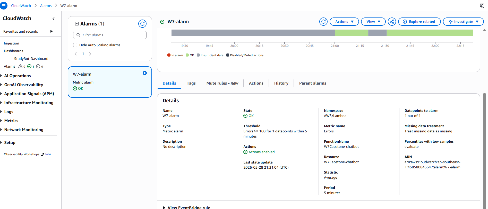

<sub>Note: Cảnh báo CloudWatch Alarm theo dõi tỷ lệ lỗi hoặc latency vượt ngưỡng, đang hoạt động ở trạng thái bình thường (OK) hoặc cảnh báo (ALARM).</sub>

**Lưu câu truy vấn Log Insights:**

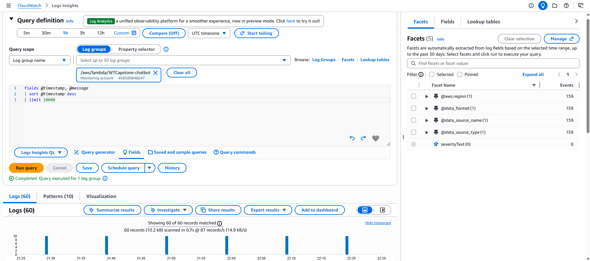

<sub>Note: Câu truy vấn CloudWatch Log Insights lọc log lỗi hệ thống trong 1 giờ qua đã được lưu thành công trên bảng điều khiển để truy cập nhanh khi vận hành.</sub>

---

## Section 7 — Bonus Paths

### 7.1 Custom Domain & HTTPS via Route 53 + ACM (Bonus Path A)

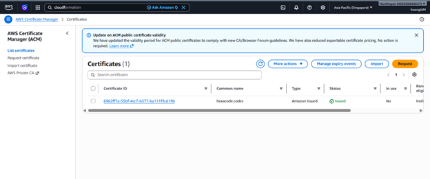

<sub>Note: Ảnh chụp chứng chỉ SSL trạng thái "Issued" cấp bởi ACM cho tên miền tùy chỉnh của nhóm, được ánh xạ qua Route 53 trỏ tới CloudFront Distribution.</sub>

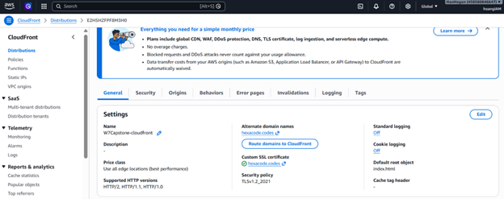

<sub>Note: Ảnh chụp chứng chỉ SSL trạng thái "Issued" cấp bởi ACM cho tên miền tùy chỉnh của nhóm, được ánh xạ qua Route 53 trỏ tới CloudFront Distribution.</sub>

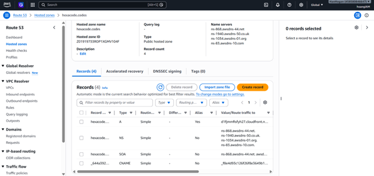

<sub>Note: Ảnh chụp chứng chỉ SSL trạng thái "Issued" cấp bởi ACM cho tên miền tùy chỉnh của nhóm, được ánh xạ qua Route 53 trỏ tới CloudFront Distribution.</sub>

### 7.3 Infrastructure as Code (IaC) Stack (Bonus Path C)


<sub>Note: Ảnh chụp trạng thái Stack ở AWS CloudFormation ở trạng thái "CREATE_COMPLETE", chứng minh hạ tầng được quản lý và triển khai tự động qua Code (CDK/Terraform/SAM).</sub>

### 7.4 Amazon Bedrock Guardrails Setup (Bonus Path D)

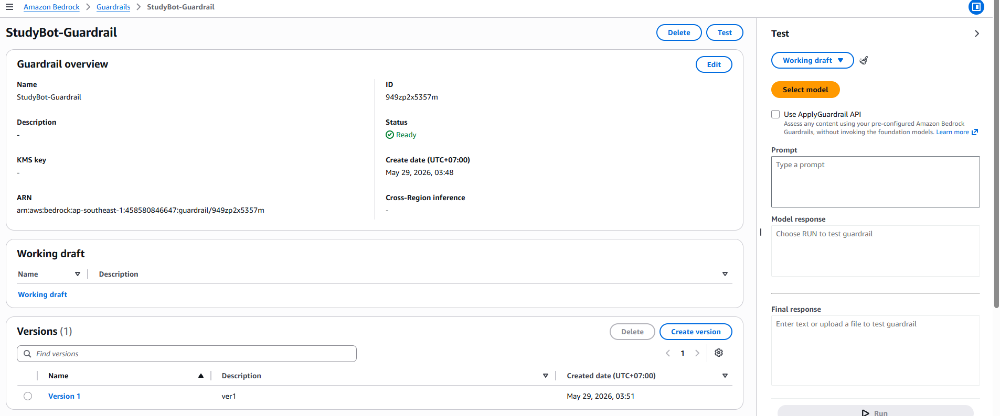

<sub>Note: Cấu hình bộ lọc Guardrails trên Amazon Bedrock chặn lọc thông tin nhạy cảm PII và kiểm soát chất lượng từ ngữ đầu ra của mô hình.</sub>

---

## Section 8 — Customization & Originality (Quiz & Flashcards)

### 8.1 Trắc nghiệm tương tác Quiz Engine

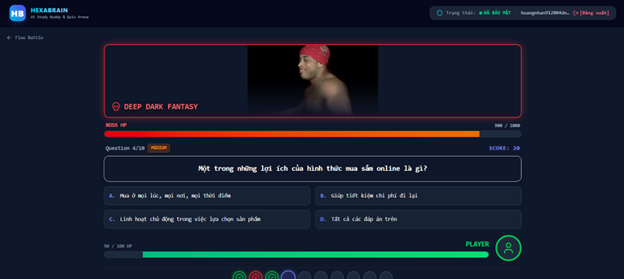

<sub>Note: </sub>

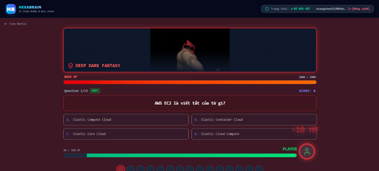

<sub>Note: </sub>

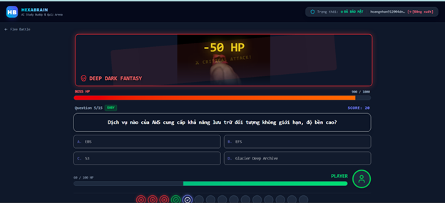

<sub>Note: </sub>

### 8.2 Thẻ ghi nhớ xoay Flashcards 3D

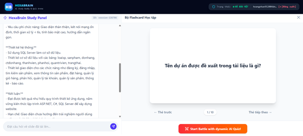

<sub>Note: </sub>

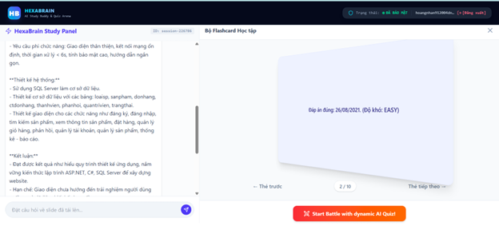

<sub>Note: </sub>

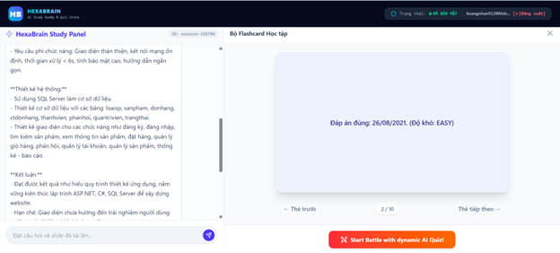

<sub>Note: </sub>

---

## Section 9 — Measurement & Decisions (Mục §6.5 chống đối phó)

### Decision Block 1: Lựa chọn mô hình ngôn ngữ lớn (LLM) cho RAG & Quiz Generation

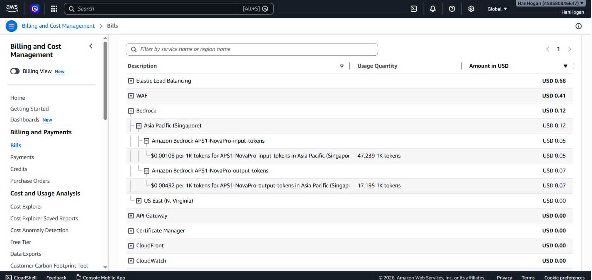

```
DECISION: 
Sử dụng Claude 3.5 Haiku trực tiếp trên Bedrock thay vì dùng Claude 3.5 Sonnet trong quá trình phát triển và chạy thử.

ALTERNATIVES CONSIDERED:
- Claude 3.5 Sonnet: Loại bỏ vì chi phí token quá cao ($3.00/$15.00 per 1M tokens input/output) dẫn đến nguy cơ vượt ngân sách khi gọi test liên tục.
- Amazon Titan Text Express: Loại bỏ vì độ chính xác trong việc trích xuất thông tin tiếng Việt và lập luận câu hỏi trắc nghiệm dưới dạng cấu trúc JSON không ổn định.

MEASUREMENT:
- Chi phí chạy thử: Claude 3.5 Haiku tốn ~$0.25/$1.25 per 1M tokens, giảm thiểu 90% chi phí phát triển.
- Độ trễ phản hồi trung bình: Haiku phản hồi trong 1.5 giây (Sonnet tốn trung bình 3.8 giây).

TRADE-OFF ACCEPTED:
- Chấp nhận chất lượng lập luận thấp hơn một chút so với Sonnet, tuy nhiên Haiku hoàn toàn đủ khả năng trả lời chính xác dựa trên tài liệu học tập được RAG cung cấp.
```

### Decision Block 2: Công nghệ lưu trữ dữ liệu Database cho cấu hình Session Log

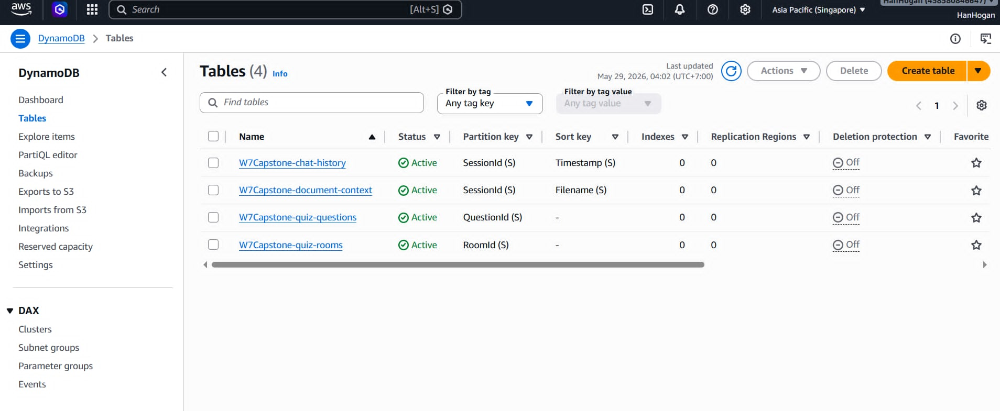

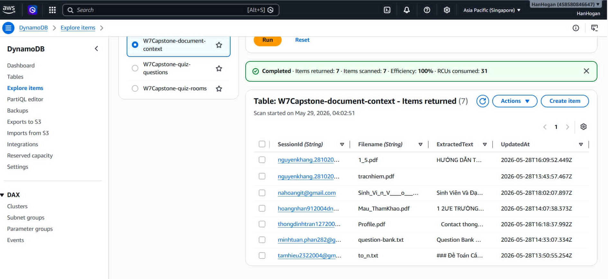

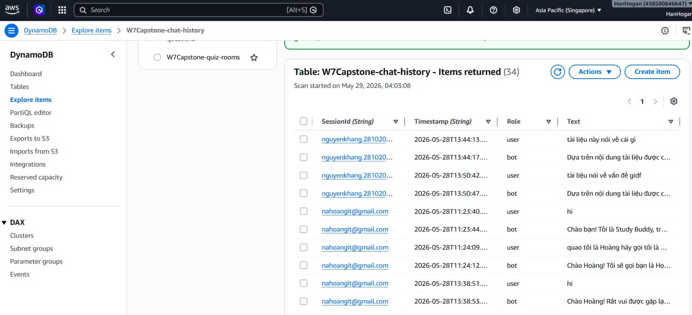

```
DECISION:
Sử dụng Amazon DynamoDB (On-Demand capacity) thay vì Amazon RDS PostgreSQL.

ALTERNATIVES CONSIDERED:
- Amazon RDS PostgreSQL db.t3.micro: Loại bỏ vì chi phí duy trì cố định (~$1.25/48h) và mất thời gian kết nối qua RDS Proxy để tránh nghẽn khi Lambda mở rộng đồng thời.

MEASUREMENT:
- Chi phí vận hành: DynamoDB tốn $0.00 cho nhu cầu hackathon (nằm trong 25GB free tier).
- Tốc độ truy vấn: Thời gian đọc ghi session log bằng DynamoDB SDK luôn dưới 10ms.

TRADE-OFF ACCEPTED:
- Chấp nhận việc không thực hiện được các câu lệnh SQL JOIN phức tạp hoặc phân tích dữ liệu chuyên sâu. Đổi lại, hệ thống cực kỳ dễ mở rộng và miễn phí hoàn toàn.
```

---

## Section 10 — Project Demonstration

### Giao diện chính của hệ thống hoạt động thực tế

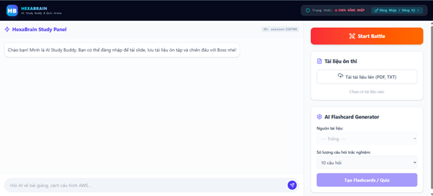

<sub>Note: Màn hình Dashboard tổng quan của StudyBot hiển thị các thông số hoạt động học tập thực tế và nhật ký.</sub>

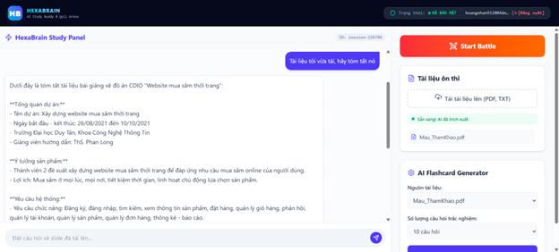

<sub>Note: Khung chat hỏi đáp AI RAG hiển thị bong bóng chat sinh động kèm liên kết dẫn nguồn chi tiết.</sub>

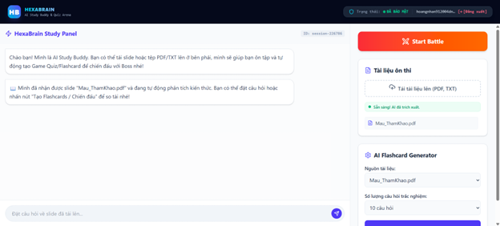

<sub>Note: Khung chat hỏi đáp AI RAG hiển thị bong bóng chat sinh động kèm liên kết dẫn nguồn chi tiết.</sub>

---

## Section 11 — Teardown Plan & Checklist

### 11.1 Trình tự xóa tài nguyên (Teardown Order)
Để đảm bảo không bị lỗi phụ thuộc (dependency errors) khi xóa tài nguyên trên AWS, nhóm áp dụng trình tự xóa ngược lại với lúc triển khai:

# AWS Teardown Plan - W7Capstone Project

---

## THỨ TỰ ƯU TIÊN (Xóa ngay để dừng tính phí)
1.  **Amazon Bedrock Knowledge Base & OpenSearch Serverless** (Chi phí duy trì cao ~ $0.24/giờ).
2.  **AWS WAF** (Phí duy trì Web ACL hàng tháng).
3.  **NAT Gateway** (Nếu có cấu hình trong VPC - phí tính theo giờ rất cao).

---

## 🛠️ CHI TIẾT CÁC BƯỚC THỰC HIỆN

### Bước 1: Amazon Bedrock & Vector Store
*   **Knowledge Base (KB):** Vào **Bedrock Console** ➡️ **Knowledge bases** ➡️ Chọn KB của dự án ➡️ Bấm **Delete**.
*   **Vector Store (OpenSearch Serverless):** Vào **Amazon OpenSearch Service** ➡️ **Serverless** ➡️ **Collections** ➡️ Xóa Collection liên kết với KB.
*   **Guardrail:** Vào **Bedrock** ➡️ **Guardrails** ➡️ Chọn guardrail dự án và bấm **Delete**.

### Bước 2: CloudFront, WAF & Networking Ngoài
1.  **CloudFront Distribution:**
    *   Vào **CloudFront Console** ➡️ Chọn Distribution ➡️ Bấm **Disable**.
    *   Sau khi trạng thái là `Disabled`, chọn lại và bấm **Delete**.
2.  **AWS WAF:** Vào **WAF & Shield** ➡️ **Web ACLs** ➡️ Xóa Web ACL liên kết với CloudFront.
3.  **Route 53:** Xóa các bản ghi `A` hoặc `CNAME` trỏ về CloudFront (Không xóa NS và SOA).
4.  **ACM:** Vào **Certificate Manager** ➡️ Xóa SSL Certificate đã dùng.

### Bước 3: API Gateway & Cognito
*   **API Gateway:** Vào **API Gateway Console** ➡️ Chọn API dự án ➡️ Bấm **Delete**.
*   **Cognito User Pool:** 
    *   Vào **Cognito Console** ➡️ **User Pools**.
    *   Xóa **App Clients** trong tab App Integration trước.
    *   Sau đó quay lại trang chính của Pool và bấm **Delete**.

### Bước 4: Lambda Functions & IAM Roles

1.  **Lambda Functions:** Xóa lần lượt 3 functions:
    *   `W7Capstone-chatbot`
    *   `W7Capstone-quiz`
    *   `W7Capstone-extractor`
2.  **IAM Roles:** Vào **IAM Console** ➡️ **Roles** ➡️ Xóa các Role đã tạo cho dự án này.

### Bước 5: Làm rỗng và Xóa 4 S3 Buckets
*Thực hiện quy trình: Chọn Bucket ➡️ Bấm **Empty** ➡️ Nhập xác nhận ➡️ Quay lại bấm **Delete**.*
1.  `w7capstone-fe-host-*` (Frontend)
2.  `w7capstone-vector-store-*` (Vector)
3.  `w7capstone-raw-uploads-*` (Raw store)
4.  `w7capstone-clean-store-*`

### Bước 6: Database & Secrets
*   **DynamoDB Tables:** Xóa 4 bảng: `chat-history`, `quiz-rooms`, `quiz-questions`, `document-context`.
*   **Secrets Manager:** Chọn secret dự án ➡️ **Delete secret** ➡️ Chọn **Force deletion without recovery**.

### Bước 7: Giải phóng hạ tầng VPC 
1.  **VPC Endpoints:** Vào **VPC Console** ➡️ **Endpoints** ➡️ Xóa toàn bộ (S3, DynamoDB, Bedrock, Secrets Manager).
2.  **NAT Gateway:** (Nếu có) Xóa NAT Gateway và giải phóng Elastic IP.
3.  **Internet Gateway:** Chọn IGW ➡️ **Detach from VPC** ➡️ **Delete**.
4.  **VPC:** Vào **Your VPCs** ➡️ Chọn dự án VPC ➡️ **Actions** ➡️ **Delete VPC**.

---

*— End of W7 Evidence Pack —*
